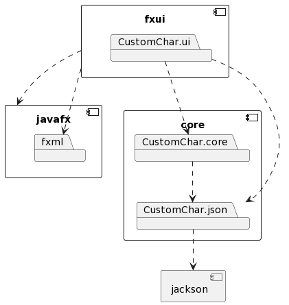

# Arkitektur

Arkitekturen til prosjektet vårt er delt inn i to hovedmapper som stammer fra /CustomChar-Project/.

/core/ fokuserer på hovedlogikken til applikasjonen vår som håndterer gjennom manipulering og lagring av informasjonen.

/fxui/ er å kontrollere brukergrensesnittet til applikasjonen, for eksempel å endre farger til karakterene våre og se endringene i applikasjonen.

Et diagram over arkitekturen vår er vist nedenfor sammen med PlantUML



```
@startuml firstDiagram
component core {
  package CustomChar.core
  package CustomChar.json
}

[CustomChar.core] ..> [CustomChar.json]

CustomChar.json ..> [jackson]

component fxui {
  package CustomChar.ui
}

CustomChar.ui ..> CustomChar.core
CustomChar.ui ..> CustomChar.json

component javafx {
  package fxml
}

fxui ..> javafx
fxui ..> fxml

@enduml
```

# Arbeidsvalg

## Arbeidsvaner

Når du lager endringer er det veldig nyttig å skrive kode sammen og utveksle kode. Vi benyttet oss derfor mye av parprogrammering. Vi bestemte oss derimot for å gjøre mesteparten av kodingen digitalt slik at vi kunne spare reisetid, samt å kunne jobbe fra våre stasjonære pc-er som vi alle presterer bedre på. For å oppnå en parprogrammeringserfaring som ligner på den vi ville hatt hvis vi møtte fysisk, brukte vi VSCode Live Share som lar oss redigere de samme filene og teste appen i sanntid. Dette gjør det enkelt å gjøre små og store endringer når det trengs, samt å se på noens kode før du pusher den.

Andre vaner vi har jobbet med er å lage grener knyttet til "issues" for å isolere alt arbeidet knyttet til den oppgaven. Dette gjør at vi kan holde alle endringene våre organisert før vi slår sammen endringer, samt skape problemer for hva som må jobbes med og holde oversikt over alt arbeidet. Andre endringer fra våre tidligere innleveringer innebærer mer i dybden commit-meldinger som inneholder en bedre beskrivelse av hva som er endret og medforfattere av commit-en. Vi har og forsatt med bruk av milestones for innleveringen til å holde styr på hvilken issues er relateret til releasene.

Bruken av disse verktøyene har hjulpet med å forbedre arbeidsvanene våre, og gjort det lettere å jobbe sammen og samarbeide.

## Kodekvalitet

For å sjekke kvaliteten på koden vår brukte vi tre forskjellige verktøy; Java Code Coverage (JaCoCo), Spotbugs og Checkstyles.

Spotbugs er et verktøy som kvalitetssikrer koden, ved å se etter bugs i koden. Vi valgte Spotbugs på grunn av dens brukervennlighet og funksjonalitet med Maven.

Java Code Coverage eller JaCoCo lar oss sjekke hvilke deler av koden vår som blir testet. Verktøyet sparer oss tid ved å se etter utestede deler av koden, slik at vi kan heller bruke tiden på å forbedre og fjerne overflødige deler av koden.

Vi brukte Checkstyles for å forsikre oss om at koden vår følger generelle kodestandarder ved å sjekke hvordan metodene er innkapslet og strukturert.