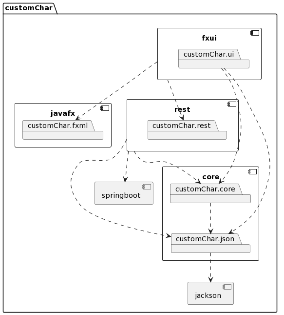
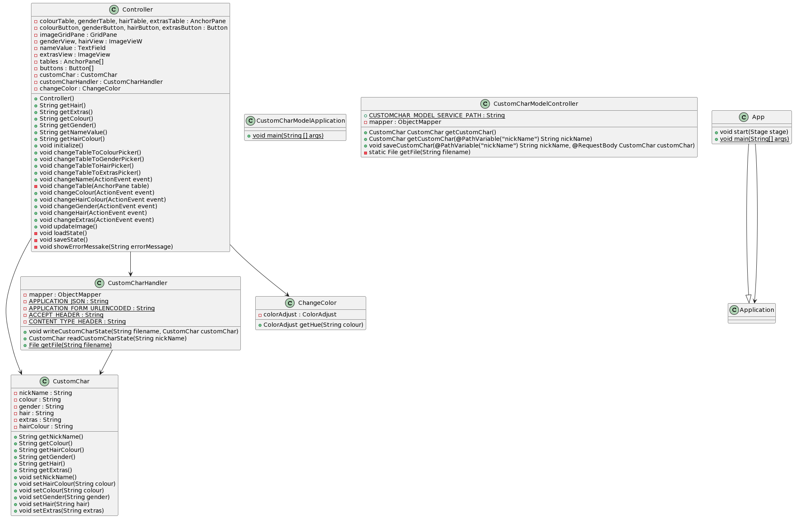
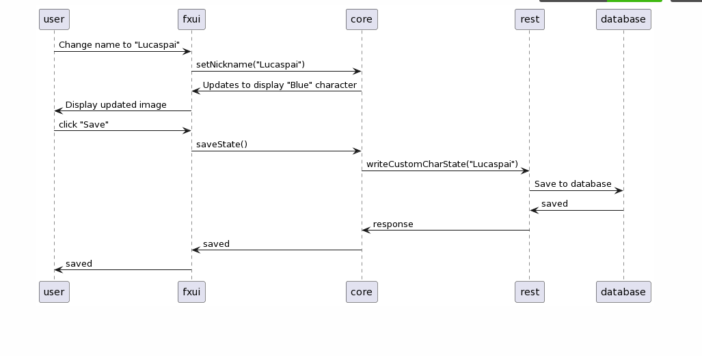

# Arkitektur

Arkitekturen til applikasjonen vår er lettest forklart gjennom diagrammer som viser både klasse og pakkestrukturen.



Pakkediagrammet viser hvordan alle pakkene er koblet og jobber sammen, det gir en rask og enkel oversikt over filstrukturen og hva som er viktig.



Klassediagrammet gir en oversikt over hvilke funksjoner som er i de forskjelige filene uten å trenge å skjekke alle modulene selv.



Sekvensdiagrammet viser koblingen mellom brukerinteraksjon og hva som skjer inni systemet.

# Arbeidsvalg

## Arbeidsvaner
Arbeidsvanene våre fra øving 2 funket veldig bra, så vi bestemte oss for å beholde dem når vi jobbet på øving 3. Se dokumentasjonen i release 2 for en beskrivelse av disse arbeidsvanene.

## Kodekvalitet
Vi hadde en del checkstyle warnings vi ikke hadde fikset på fra øving 2, som for eksempel feil bruk av indentations og manglende javadoc kommentarer. Vi hadde brukt 4 spaces for indentations, mens checkstyle sin default verdi var 2 spaces. Vi bestemte oss for å heller skifte på checkstyle settingsene til å gjøre indentation verdien til 4 spaces, siden vi alle var enige om at det ser finere og ryddigere ut. Da slapp vi også å fjerne indentation spaces fra hele koden. Vi la også til javadoc kommentarer på alle metodene som manglet det.

# Rest tjenesten
I motsetning til tidligere øvinger hvor CustomChar objektene ble lagret lokalt på datamaskinen til brukeren, blir de nå lagret på en lokal server.

HTTP requestene vi har lagt til rette for at man kan bruke er POST og GET. Vi valgte disse fordi de er standard metoder for å returnere og sende informasjon til en server. GET requesten er på formatet "http://localhost:8080/customChar/{nickName}", og henter ned et CustomChar object med navnet {nickName}. POST requesten lagrer CustomChar objektet i pathen "http://localhost:8080/customChar/save/{nickName}", og kan så bli hentet igjen med en GET request.

Karakteren er lagret i formatet
```json
{
    "nickName":"name",
    "colour":"colour",
    "gender":"gender",
    "hair":"hair",
    "extras":"extras",
    "hairColour":"hairColour"
}
```

Til å lese filer bruker det URIen 
```
http://localhost:8080/customChar/{nickName}
```

og til å skrive bruker der URIen 
```
http://localhost:8080/customChar/save/{nickName}
```